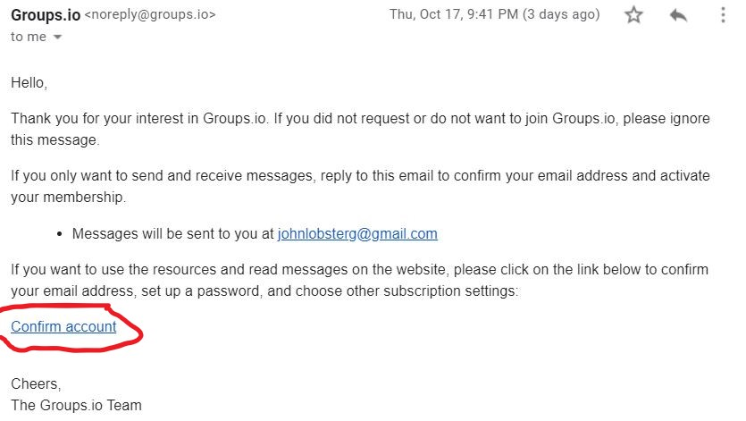

# Moving from yahoo groups to groups.io

## Create a new account on groups.io

If you already have an account there, then skip this step

Go to groups.io and click on "Sign up"

Fill in your email and password, then click "create an account"

It will then send you email so that you can confirm creating your account. Go to the email you were sent and click on "confirm account"

This then takes you back to groups.io

## Find the MWS group and request permission to be added

click on "Find groups" (in above picture)  
There are other buttons that will let you find groups but this works

Enter "sacramento miniatures" (or something similar)

Click on MWS

Scroll down until you see "+ Apply for membership in this group" and click the button

This is the final signup screen

You will then need to wait for our outstanding administrator (The cat herder in chief) to accept you

When he does, you will get an email like this. Clicking on groups.io/MWS will take you to the groups page

You now have access to MWS !!

These instructions can be found at 
